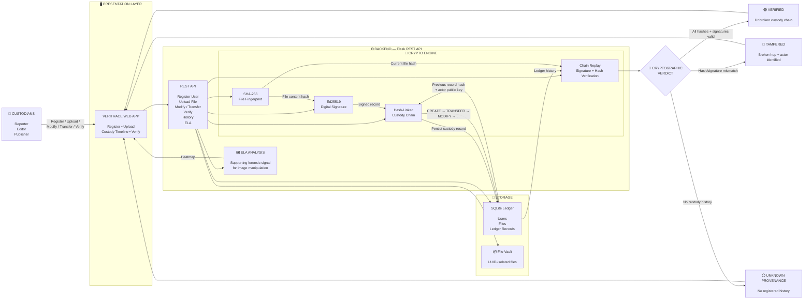

# VERITRACE — System Architecture

VERITRACE is a cryptographic chain-of-custody platform that gives digital files a verifiable identity and records every custody action in a signed, hash-linked ledger.

## 🔐 How VERITRACE Works

1. **Register** — A custodian receives an Ed25519 cryptographic identity.
2. **Create** — The uploaded file is SHA-256 hashed and recorded in a signed `CREATE` record.
3. **Track** — Every `TRANSFER` or `MODIFY` action creates another signed record linked to the previous record using `prev_record_hash`.
4. **Verify** — The current file is hashed again and the entire custody chain is replayed. Every signature and hash link is validated.
5. **Verdict** — VERITRACE returns:
   - 🟢 **VERIFIED** — the file and custody chain are consistent.
   - 🔴 **TAMPERED** — a cryptographic inconsistency is detected and the broken hop is identified.
   - ⚪ **UNKNOWN PROVENANCE** — no registered custody history exists.
6. **ELA** — For images, Error Level Analysis provides a visual forensic signal alongside the cryptographic verdict.

### Core Principle

> **SHA-256 proves what the file is.  
> Ed25519 proves who signed it.  
> Hash chaining proves what happened to it.  
> Verification proves whether the history still holds.**

### Technology Stack

`Frontend: HTML/CSS/JS` · `Backend: Python + Flask` · `Cryptography: Ed25519 + SHA-256` · `Database: SQLite` · `Image Analysis: Pillow + NumPy` · `Storage: Local UUID File Vault`
