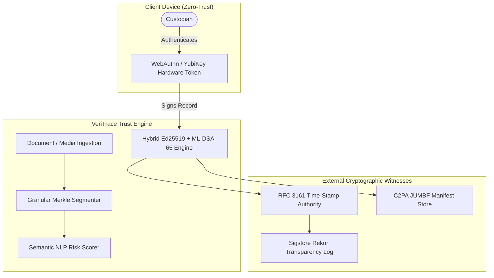

# VeriTrace: Strategic Architectural & Innovation Roadmap

This document outlines high-impact architectural enhancements, advanced cybersecurity hardening measures, and cutting-edge innovations for transitioning **VeriTrace** from an MVP into an enterprise-grade, standard-compliant provenance platform.

---

## 1. Cybersecurity & Cryptographic Hardening

```
┌──────────────────────────────────────────────────────────────────────────────────┐
│                         Enterprise Security Architecture                         │
├─────────────────────────┬────────────────────────────┬───────────────────────────┤
│    Hardware Roots       │    Decentralized Trust     │    Zero-Knowledge Proofs  │
│ • WebAuthn / FIDO2 / TPM│ • RFC 6962 Rekor Log       │ • Selective Disclosure    │
│ • Hardware Security Mod │ • RFC 3161 Trusted TSA     │ • Validated Redaction     │
│ • Client-Side Signing   │ • W3C DID & PKI / X.509    │ • Privacy-Preserving Proof│
└─────────────────────────┴────────────────────────────┴───────────────────────────┘
```

### 1.1. Client-Side Cryptographic Hardware Roots (Zero-Trust Key Custody)
* **Current State**: Private keys are generated and stored in-memory server-side (`PRIVATE_KEYS` dict) for hackathon demo ergonomics.
* **Production Risk**: A server breach or compromised administrator compromises all custodian identities and allows retroactive record forgery.
* **Proposed Enhancement**:
  * **WebAuthn / FIDO2 Integration**: Perform signing operations directly inside user hardware authenticators (YubiKey, Apple Touch ID / Secure Enclave, Windows Hello). The private key never leaves the secure element.
  * **HSM & Cloud KMS Backends**: For organizational custodians, integrate AWS KMS / Google Cloud HSM / Vault Transit Engine for automated signing with hardware-enforced audit logs.
  * **Passkey-Based Custodian Identity**: Replace arbitrary UUIDs with WebAuthn credential public keys.

### 1.2. Cryptographically Bound External Timestamps (RFC 3161 / Roughtime)
* **Current State**: Record timestamps use local server system time (`time.time()`).
* **Production Risk**: Rogue system administrators or server clock skew can backdate or postdate custody transitions.
* **Proposed Enhancement**:
  * **RFC 3161 Time-Stamp Authority (TSA)**: Anchor each `record_hash` with an authenticated timestamp token from a recognized external TSA (e.g., DigiCert, Sectigo, or public trusted TSAs).
  * **Decentralized Roughtime Beacons**: Incorporate Google/Cloudflare Roughtime signatures into record metadata to prove records were created within a cryptographically bounded temporal window without relying on local clock veracity.

### 1.3. Public Witnessing & Immutable Transparency Logs (Sigstore / Rekor)
* **Current State**: Ledger records reside solely in a centralized SQLite database (`veritrace.db`).
* **Production Risk**: A malicious database operator could rewrite the entire database history and compute a new valid chain.
* **Proposed Enhancement**:
  * **Append-Only Merkle Transparency Logs**: Submit periodic ledger checkpoints or individual record hashes to a public append-only log (such as Sigstore's Rekor or an internal Trillian log).
  * **Gossip & External Witnessing**: Allow third-party verification nodes (news agencies, auditors, law firms) to monitor Merkle tree consistency proofs and detect split-view / history-rewriting attacks.

### 1.4. Zero-Knowledge Proofs for Verifiable Redaction (zk-SNARKs)
* **Current State**: Modifying a document requires full re-uploading and reveals the transformed content.
* **Production Risk**: In journalism and legal discovery, sensitive whistle-blower names, classified details, or PII must be redacted without invalidating the document's original chain of custody.
* **Proposed Enhancement**:
  * **ZK Selective Redaction**: Use zk-SNARKs / Circom circuits to mathematically prove:
    $$\text{Hash}(\text{Redacted Doc}) \text{ derives strictly from } \text{Hash}(\text{Original Doc})$$
    by masking authenticated Merkle leaves without revealing the underlying sensitive text.

### 1.5. Multi-Party Threshold Custody (FROST / Shamir's Secret Sharing)
* **Current State**: 1-of-1 custody model (a single custodian alone signs transfer/modification).
* **Production Risk**: Insider threat or compromised credential can unauthorizedly transfer high-value assets.
* **Proposed Enhancement**:
  * **$m$-of-$n$ Threshold Signatures (FROST / Ed25519 Threshold)**: Require multiple designated custodians (e.g., Lead Reporter + Managing Editor + Legal Counsel) to jointly generate a single valid signature before an asset state transition is committed.

---

## 2. Frontier Innovations & Feature Upgrades

```
┌──────────────────────────────────────────────────────────────────────────────────┐
│                             Frontier Innovation Vector                           │
├─────────────────────────┬────────────────────────────┬───────────────────────────┤
│    Standard Compliance  │    AI Deepfake Forensics   │    Semantic Impact Engine │
│ • C2PA / CAI Standards  │ • Frequency DCT / FFT Foren│ • Semantic NLP Risk Score │
│ • JUMBF Metadata Embed  │ • Neural Splicing Detect   │ • Clause Intent Tracking  │
│ • Camera-to-Browser Spec│ • Multi-Modal Audio/Video  │ • Legal Risk Categorizer  │
└─────────────────────────┴────────────────────────────┴───────────────────────────┘
```

### 2.1. C2PA (Coalition for Content Provenance and Authenticity) Standard Compliance
* **Vision**: Seamless interoperability with the global standard adopted by Adobe, Nikon, Sony, Leica, Microsoft, and Google.
* **Implementation Plan**:
  * Implement JUMBF (JPEG Universal Metadata Box Format) embedding directly into the binary containers of verified images, video, and audio files.
  * Ensure VeriTrace manifests can be read by native C2PA inspectors (such as `contentauthenticity.org` and web browser extensions).
  * Enable **Hardware-Assisted Ingestion**: Ingest photos directly signed by camera firmware (C2PA-enabled cameras from Sony and Leica).

### 2.2. Multi-Modal AI & Deepfake Forensic Pipeline
* **Beyond Basic ELA**: ELA is heuristic and works primarily on JPEG compression differences. Modern synthetic media requires multi-tier forensic inspection:
  1. **Spatial & Frequency Domain Analysis**: Discrete Cosine Transform (DCT) and 2D Fourier Transform (FFT) analysis to uncover generative AI grid artifacts and high-frequency GAN/diffusion patterns.
  2. **Camera Sensor PRNU (Photo-Response Non-Uniformity)**: Extract camera sensor fingerprint noise to verify if every pixel originated from the exact claimed physical sensor.
  3. **Audio Biometrics & Spectral Splicing**: For recorded evidence, detect synthetic voice cloning (vocoder artifacts) and background ambient room acoustic continuity.

### 2.3. Semantic Impact & NLP-Powered Tamper Assessment
* **Current State**: Pinpoints *which* line or slide was modified (e.g., `Line 9 (Modified)`).
* **Innovation**: Understand *what the change means* using local on-premise NLP embeddings:
  * **Semantic Shift Analysis**: Computes cosine similarity between embeddings of original and tampered segments to produce a **Semantic Tamper Score (0-100%)**.
  * **Intent & Risk Categorization**:
    * *Benign*: Formatting, typo corrections, whitespaces.
    * *Substantive*: Numeric modifications (financial figures, dates, percentages).
    * *Critical / High-Risk*: Negation inversion (e.g., changing *"party shall be indemnified"* to *"party shall not be indemnified"*).

### 2.4. Decentralized Content Addressing & Redundant Storage
* **Current State**: Local disk storage in `backend/uploads/`.
* **Innovation**:
  * Integrate IPFS (InterPlanetary File System) or Arweave for permanent, decentralized content addressing.
  * The cryptographic Content Identifier (CID) becomes self-verifying and completely immune to local file path corruption or hosting server outages.

---

## 3. High-Priority Implementation Matrix

| Phase | Category | Feature | Impact | Complexity |
| :---: | :--- | :--- | :---: | :---: |
| **Q1** | Cybersecurity | Client-side WebAuthn / Passkey FIDO2 Hardware Signing | Critical | Medium |
| **Q1** | Standard | C2PA / JUMBF Manifest Exporter for Media Assets | High | Medium |
| **Q2** | Cybersecurity | RFC 3161 Trusted Time-Stamp Authority (TSA) Token Anchoring | High | Low |
| **Q2** | Innovation | NLP Semantic Risk Scorer for Alteration Localization | High | Medium |
| **Q3** | Cybersecurity | Sigstore / Rekor Public Transparency Log Mirroring | Critical | High |
| **Q3** | Innovation | DCT & PRNU Sensor Noise Forensic Analysis Engine | High | High |
| **Q4** | Cybersecurity | Zero-Knowledge (zk-SNARK) Verifiable Selective Redaction | Breakthrough | Very High |
| **Q4** | Architecture | $m$-of-$n$ FROST Threshold Multi-Party Signatures | High | High |

---

## 4. Architecture Evolution Diagram


